# VertiBalance 眩晕智能辅助诊疗平台 需求规格说明书

# **1. 组件定位**

## **1.1 核心职责**
本组件负责基于 MedChat 眩晕领域大模型为患者提供智能预问诊、危险信号筛查、辅助分诊与挂号推荐，为医生提供病情摘要、辅助分析和随访管理，实现眩晕患者诊前到诊后的医患协同闭环。

## **1.2 核心输入**
1. 患者通过患者端发起的注册登录、自然语言问诊对话、挂号确认、随访反馈、健康科普查询请求。
2. 医生通过医生端发起的登录、患者列表查询、问诊资料查看、辅助分析请求、接诊处置记录、随访任务管理请求。
3. 管理员通过管理端发起的用户角色管理、医生排班配置、模型版本管理、知识库维护、统计查询、审计查询请求。
4. MedChat 模型服务返回的问诊追问、症状提取、摘要生成、辅助分析、科普内容等结构化推理结果。
5. 定时任务触发的随访提醒、复诊提醒、用药提醒、异常情况再就医提示信号。

## **1.3 核心输出**
1. 返回给患者的引导式问诊追问、风险等级与就医建议、挂号卡片、结构化问诊报告、健康科普内容、随访提醒。
2. 推送给医生的待接诊患者列表、AI 问诊摘要、风险等级标记、辅助分析参考、患者历史记录、随访反馈。
3. 返回给管理员的运营统计报表、模型调用状态、审计日志、用户与排班配置结果。
4. 发送给 MedChat 模型服务的问诊上下文、提示词、结构化输出约束请求。
5. 发布给患者的站内通知、复诊提醒、康复训练提醒、异常再就医提示。

## **1.4 职责边界**
1. 不替代医生进行临床确诊、排除疾病、开具处方或决定最终治疗方案。
2. 不直接完成线下挂号支付、医保结算和检查预约扣费，仅生成挂号订单并移交。
3. 不负责医院内部 HIS、LIS、PACS 系统的检查结果采集，仅接收患者补充上传的资料。
4. 不承担医学继续教育、医生资质认证、医院科室真实排班数据的权威维护。
5. 不对 MedChat 模型本身的训练、微调和权重更新负责，仅负责模型版本与服务地址配置。
6. 不在患者端输出"已确诊""可以排除""一定没问题""无需就医""绝对安全"等确定性结论。

# **2. 领域术语**

**眩晕**
: 患者主观感受到自身或周围环境在旋转、倾倒或摆动的一种运动性错觉，是本平台核心关注症状。

**头昏**
: 患者感受到头部昏沉、不清醒，但不伴有明显旋转感，需与眩晕区分。

**失衡**
: 患者行走或站立时感觉身体不稳、有倾倒倾向，属于平衡障碍范畴。

**危险信号**
: 提示可能存在脑卒中、中枢神经系统病变等需紧急处理情况的临床表现，规则引擎识别优先级高于大模型结果。

**风险等级**
: 系统根据症状和危险信号对患者当前病情严重程度给出的分级结论，取值包括紧急、高、中、低四级。

**分诊**
: 系统根据风险等级和症状特征推荐患者就诊科室、就诊时效和就诊方式的过程。

**引导式问诊**
: 系统按照医学问诊逻辑主动向患者提问，逐步采集症状、诱因、持续时间、伴随表现的方式。

**问诊报告**
: 系统将问诊对话自动整理生成的结构化文档，包含主诉、发作特点、诱发因素、伴随症状、危险信号、既往史、用药情况、AI 风险提示、推荐就诊方向。

**问诊摘要**
: 系统为医生端生成的问诊内容精简版，用于医生快速了解患者病情，区别于完整对话记录。

**AI 辅助分析**
: 系统为医生提供的症状要点提取、追问建议、鉴别诊断方向、危险信号提示和检查项目建议，仅作参考。

**随访**
: 患者诊疗结束后，平台按计划定期收集症状变化、用药情况、康复进展并提醒复诊的过程。

**MedChat**
: 平台对接的眩晕领域医疗大模型，负责问诊追问、症状提取、摘要生成、辅助分析和科普内容生成。

**挂号移交**
: 患者确认挂号后，系统将问诊记录与病情摘要移交给对应医生的过程，是问诊到诊疗闭环的关键环节。

**免责声明**
: 患者端必须显示的"本系统仅用于辅助筛查和健康信息参考，不能替代医生面诊和临床诊断"提示。

# **3. 角色与边界**

## **3.1 核心角色**
1. **患者**：通过患者端进行注册登录、智能问诊、查看报告、确认挂号、记录随访反馈、浏览健康科普。
2. **医生**：通过医生端查看患者工作台、阅读 AI 问诊资料、参考辅助分析、填写接诊处置、管理随访任务。
3. **平台管理员**：通过管理端维护用户角色、医生排班、模型配置、知识库、统计运营和审计安全。

## **3.2 外部系统**
1. **MedChat 模型服务**：接收平台问诊上下文与提示词，返回结构化问诊追问、症状提取、摘要、辅助分析和科普内容。
2. **医院挂号系统（可选）**：接收平台生成的挂号订单，回传挂号确认结果，当前版本可由平台内部承接挂号登记。
3. **消息通知渠道**：接收平台发出的随访提醒、复诊提醒、用药提醒、异常再就医提示，通过站内信或外部推送触达患者。

## **3.3 交互上下文**
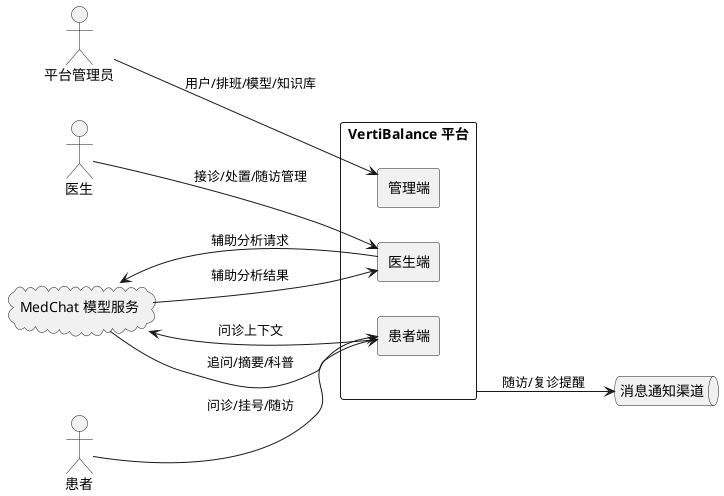

# **4. DFX约束**

## **4.1 性能**
1. 患者端单条问诊消息从提交到收到模型追问的响应时间在正常负载下不超过 8 秒，P95 不超过 15 秒。
2. 医生端打开患者问诊资料页面的响应时间不超过 2 秒。
3. 管理端统计报表查询响应时间不超过 5 秒。
4. 单实例并发问诊会话不低于 200 路，模型服务调用超时时间统一设置为 30 秒。
5. 所有外部 HTTP 请求必须设置超时，禁止无限等待。

## **4.2 可靠性**
1. 平台整体可用性目标不低于 99.5%。
2. MedChat 模型服务不可用时，平台不得生成确定性诊断，必须保留已有危险提示并建议患者咨询医生。
3. 模型返回非法数据或与规则引擎冲突时，系统采用更保守的风险提示。
4. 多表状态变更必须使用数据库事务，问诊记录、风险标记、挂号订单等核心数据不得出现部分写入。
5. 数据库事务中不得长时间等待大模型响应，模型调用必须在事务外完成。

## **4.3 安全性**
1. 所有接口必须经过认证鉴权，患者只能访问自己的数据，医生只能访问被授权或分配的患者。
2. 权限校验必须由后端完成，前端权限判断仅用于展示控制。
3. 密码必须使用成熟算法哈希存储，密钥和密码只能放在环境变量中。
4. 日志中禁止记录完整病历、完整对话、密码和 Token，模型调用日志不得记录完整敏感对话。
5. 关键数据查看、修改和导出必须记录审计日志。
6. 文件上传必须校验大小和类型，禁止上传可执行文件。

## **4.4 可维护性**
1. 所有数据库结构变更必须通过 Alembic 迁移，禁止手动修改生产数据库结构。
2. 模型调用必须通过统一的模型服务层，禁止散落在页面、路由或数据库代码中。
3. 后端按 router、service、repository、schemas、models 分层，禁止在路由中编写复杂业务逻辑或直接 SQL。
4. 前端 HTTP 请求统一放在 src/api/，禁止在展示组件中直接调用 fetch。
5. 必须接入问诊人数、挂号转化率、模型调用成功率、平均问诊时长等核心监控指标。

## **4.5 兼容性**
1. 患者端优先适配移动端浏览器，同时兼容桌面端。
2. 医生端和管理端适配桌面端主流浏览器。
3. API 统一使用 /api/v1/ 前缀，后续版本变更需保持向后兼容策略。
4. 模型版本切换时，已上线问诊会话不中断，新会话使用新版本。
5. 新增非空数据库字段时必须提供默认值或回填已有数据。

# **5. 核心能力**

## **5.1 患者端账户与登录**

### **5.1.1 业务规则**
1. **注册规则**：患者必须使用手机号或邮箱注册，密码必须满足复杂度要求。
   a. 验收条件：WHEN 患者提交有效手机号且密码满足复杂度 THEN THE SYSTEM SHALL 创建患者账号并返回登录凭证。
2. **登录规则**：患者使用注册凭证登录后才能发起问诊、查看报告和确认挂号。
   a. 验收条件：WHEN 未登录患者访问问诊页面 THEN THE SYSTEM SHALL 重定向到登录页并提示先登录。
3. **免责声明展示规则**：患者端首页和问诊页面必须持续显示免责声明。
   a. 验收条件：WHEN 患者进入患者端任意核心页面 THEN THE SYSTEM SHALL 显示"本系统仅用于辅助筛查和健康信息参考，不能替代医生面诊和临床诊断"。
4. **禁止项**：禁止向患者输出"已确诊""可以排除某种疾病""一定没问题""无需就医""绝对安全"等确定性结论。
   a. 验收条件：WHEN 模型返回确定性诊断结论 THEN THE SYSTEM SHALL 拦截并替换为"可能""建议进一步检查"等表述。

### **5.1.2 交互流程**
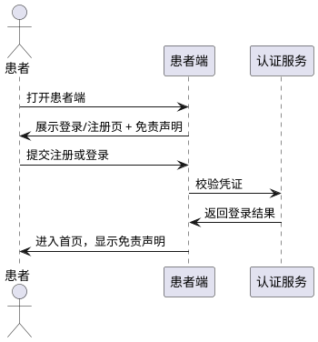

### **5.1.3 异常场景**
1. **凭证错误**
   a. 触发条件：患者提交错误的手机号、邮箱或密码。
   b. 系统行为：返回统一错误码，不区分用户名错误还是密码错误。
   c. 用户感知：提示"账号或密码错误"。
2. **账号被禁用**
   a. 触发条件：登录账号被管理员标记为禁用状态。
   b. 系统行为：拒绝登录并记录审计日志。
   c. 用户感知：提示"账号已被禁用，请联系管理员"。

## **5.2 智能问诊**

### **5.2.1 业务规则**
1. **引导式问诊规则**：系统必须按照医学问诊逻辑逐步向患者提问，采集眩晕性质、发作时间、持续时长、诱发因素、伴随症状、危险信号、既往史和用药情况。
   a. 验收条件：WHEN 患者发起问诊 THEN THE SYSTEM SHALL 通过 MedChat 生成引导式追问而非等待患者自由描述。
2. **问诊上下文维护规则**：每轮问诊必须携带完整上下文提交给模型，确保追问连贯。
   a. 验收条件：WHEN 患者发送第 N 轮消息 THEN THE SYSTEM SHALL 将前 N-1 轮对话作为上下文一并提交模型服务。
3. **结构化输出规则**：需要进入业务流程的模型结果必须使用结构化输出，经过格式、业务和医疗安全规则校验。
   a. 验收条件：WHEN 模型返回非结构化或非法字段 THEN THE SYSTEM SHALL 拒绝采纳并按失败流程处理。
4. **问诊会话状态规则**：问诊会话必须具有明确状态：进行中、已结束、已生成报告、已移交医生。
   a. 验收条件：WHEN 问诊满足结束条件 THEN THE SYSTEM SHALL 将会话标记为已结束并触发生成报告流程。
5. **历史问诊查询规则**：患者可以查看自己的历史问诊记录和报告，但不能查看他人记录。
   a. 验收条件：WHEN 患者请求历史问诊列表 THEN THE SYSTEM SHALL 仅返回该患者本人的记录。

### **5.2.2 交互流程**
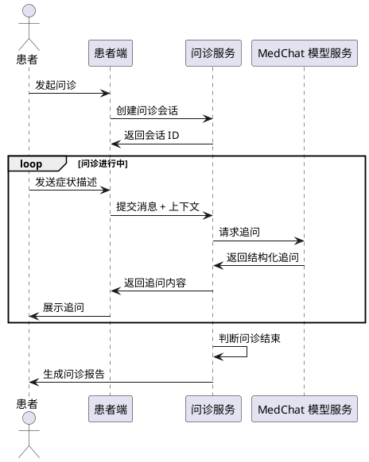

### **5.2.3 异常场景**
1. **模型服务超时**
   a. 触发条件：MedChat 模型服务在 30 秒内未返回结果。
   b. 系统行为：终止当前请求，保留已有危险提示，不生成确定性诊断，建议患者咨询医生。
   c. 用户感知：提示"问诊服务暂时不可用，已记录您的描述，建议您稍后重试或直接就医"。
2. **模型返回非法数据**
   a. 触发条件：模型返回字段缺失、格式错误或包含确定性诊断结论。
   b. 系统行为：拒绝采纳非法字段，按失败流程处理，记录模型调用失败日志。
   c. 用户感知：提示"问诊服务异常，请稍后重试"。
3. **会话并发冲突**
   a. 触发条件：同一患者在多端同时发送问诊消息。
   b. 系统行为：按到达顺序串行处理，确保上下文一致。
   c. 用户感知：无感知，问诊正常进行。

## **5.3 危险信号筛查**

### **5.3.1 业务规则**
1. **危险信号识别规则**：系统必须识别突发剧烈眩晕、单侧肢体无力或麻木、言语不清、复视、意识异常、无法站立或行走、突发严重头痛、高危基础疾病背景等危险信号。
   a. 验收条件：WHEN 患者描述中包含任一危险信号关键词或语义 THEN THE SYSTEM SHALL 立即标记危险信号并提升风险等级。
2. **规则优先级规则**：危险信号规则引擎的识别结果优先级高于大模型结果，大模型不得降低规则引擎已经确定的风险等级。
   a. 验收条件：WHEN 规则引擎判定为高风险且模型判定为中低风险 THEN THE SYSTEM SHALL 采纳规则引擎的高风险结论。
3. **高风险提示规则**：发现高风险信息时，系统必须停止普通健康建议，突出提示患者及时急诊或呼叫急救。
   a. 验收条件：WHEN 风险等级为紧急或高 THEN THE SYSTEM SHALL 隐藏普通科普内容并显示急诊提示卡片。
4. **保守提示规则**：模型不可用或结果冲突时，系统必须采用更保守的风险提示。
   a. 验收条件：WHEN 模型结果与规则引擎冲突 THEN THE SYSTEM SHALL 取两者中更高风险等级作为最终结论。
5. **禁止项**：禁止在未识别危险信号时向患者输出"绝对安全""无需就医"等结论。
   a. 验收条件：WHEN 系统未完成危险信号筛查 THEN THE SYSTEM SHALL 不输出任何安全性结论。

### **5.3.2 交互流程**
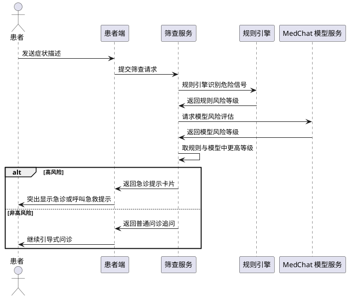

### **5.3.3 异常场景**
1. **规则引擎与模型同时失败**
   a. 触发条件：规则引擎异常且模型服务不可用。
   b. 系统行为：默认采用保守的中风险提示，建议患者就医。
   c. 用户感知：提示"无法完成风险筛查，建议您尽快就医由医生判断"。
2. **危险信号误判**
   a. 触发条件：患者描述含糊导致规则引擎误判为危险信号。
   b. 系统行为：保留危险提示，不自动降级，由医生端复核确认。
   c. 用户感知：显示急诊提示，患者可继续描述以补充信息。

## **5.4 初步风险评估与分诊**

### **5.4.1 业务规则**
1. **风险等级输出规则**：问诊结束后系统必须输出风险等级，取值为紧急、高、中、低四级。
   a. 验收条件：WHEN 问诊结束 THEN THE SYSTEM SHALL 输出明确的风险等级且取值属于四级之一。
2. **分诊建议输出规则**：系统必须输出症状摘要、可能涉及的疾病方向、推荐就诊科室、建议就诊时效、是否建议立即就医。
   a. 验收条件：WHEN 问诊结束且风险等级已确定 THEN THE SYSTEM SHALL 返回包含上述五项的分诊建议。
3. **表述约束规则**：结果必须使用"可能""建议进一步检查"等表述，禁止给出确定诊断。
   a. 验收条件：WHEN 分诊建议生成 THEN THE SYSTEM SHALL 校验文本不包含"确诊""排除""一定"等确定性词汇。
4. **就医时效映射规则**：紧急风险对应立即急诊，高风险对应 24 小时内就医，中风险对应一周内就医，低风险对应按需就医。
   a. 验收条件：WHEN 风险等级为紧急 THEN THE SYSTEM SHALL 建议立即急诊或呼叫急救。

### **5.4.2 交互流程**
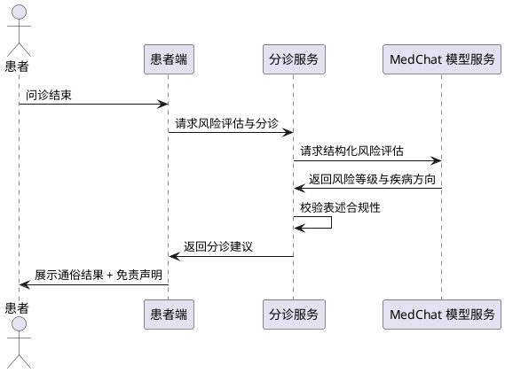

### **5.4.3 异常场景**
1. **模型返回确定性诊断**
   a. 触发条件：模型返回包含"确诊""排除"等确定性词汇的结果。
   b. 系统行为：拦截并替换为"可能""建议进一步检查"等表述。
   c. 用户感知：看到合规的辅助性建议，不出现确诊结论。
2. **疾病方向为空**
   a. 触发条件：模型未能给出可能疾病方向。
   b. 系统行为：保留风险等级和就诊科室建议，疾病方向显示"待医生进一步评估"。
   c. 用户感知：看到风险等级和就医建议，疾病方向标注待评估。

## **5.5 挂号推荐与移交**

### **5.5.1 业务规则**
1. **挂号卡片触发规则**：当系统判断患者需要就医或患者主动提出挂号时，必须在对话中弹出挂号卡片。
   a. 验收条件：WHEN 风险等级为中及以上或患者请求挂号 THEN THE SYSTEM SHALL 在对话中展示挂号卡片。
2. **挂号卡片内容规则**：卡片必须展示推荐科室、推荐医生、可预约时间、医院或院区、挂号须知。
   a. 验收条件：WHEN 挂号卡片展示 THEN THE SYSTEM SHALL 包含上述五项信息。
3. **挂号确认规则**：患者确认挂号后形成挂号订单，问诊记录与病情摘要必须移交给对应医生。
   a. 验收条件：WHEN 患者确认挂号 THEN THE SYSTEM SHALL 创建挂号订单并将问诊摘要推送到医生工作台。
4. **挂号订单唯一性规则**：同一问诊会话对同一医生同一时段只能生成一个有效挂号订单。
   a. 验收条件：WHEN 患者对同一医生同一时段重复确认挂号 THEN THE SYSTEM SHALL 拒绝重复创建并提示已挂号。
5. **禁止项**：禁止模型单独确认挂号成功，挂号成功必须由系统业务流程确认。
   a. 验收条件：WHEN 模型返回"挂号成功" THEN THE SYSTEM SHALL 不直接采纳，必须走订单创建流程。

### **5.5.2 交互流程**
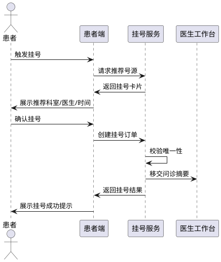

### **5.5.3 异常场景**
1. **号源已满**
   a. 触发条件：患者确认挂号时所选号源已被抢完。
   b. 系统行为：返回号源不足错误，推荐相近时段号源。
   c. 用户感知：提示"该时段号源已满，请选择其他时间"。
2. **重复挂号**
   a. 触发条件：同一问诊对同一医生同一时段重复提交挂号。
   b. 系统行为：拒绝创建新订单，返回已挂号提示。
   c. 用户感知：提示"您已挂号该医生该时段，请勿重复操作"。

## **5.6 问诊报告**

### **5.6.1 业务规则**
1. **报告自动生成规则**：问诊结束后系统必须自动将对话整理为结构化报告，包含主诉、发作特点、诱发因素、伴随症状、危险信号、既往史、用药情况、AI 初步风险提示、推荐就诊方向。
   a. 验收条件：WHEN 问诊会话标记为已结束 THEN THE SYSTEM SHALL 生成包含上述九项的结构化报告。
2. **报告与诊断分离规则**：AI 初步风险提示必须与医生最终意见分别保存，不能相互覆盖。
   a. 验收条件：WHEN 医生提交复核意见 THEN THE SYSTEM SHALL 新增医生意见记录而非覆盖 AI 提示字段。
3. **报告查询权限规则**：患者只能查看自己的报告，医生只能查看被分配患者的报告。
   a. 验收条件：WHEN 患者请求他人报告 THEN THE SYSTEM SHALL 返回未授权错误。
4. **报告历史保留规则**：历史问诊记录和报告必须长期保留，患者可随时查看。
   a. 验收条件：WHEN 患者请求历史报告列表 THEN THE SYSTEM SHALL 按时间倒序返回全部历史报告。

### **5.6.2 交互流程**
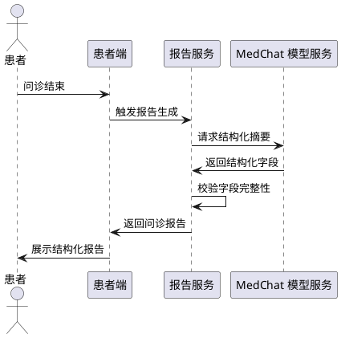

### **5.6.3 异常场景**
1. **报告字段缺失**
   a. 触发条件：模型生成的摘要缺少必填字段。
   b. 系统行为：缺失字段标注为"未采集"，不阻塞报告生成。
   c. 用户感知：看到报告，部分字段显示"未采集"。
2. **历史报告查询越权**
   a. 触发条件：患者尝试查询他人报告 ID。
   b. 系统行为：返回未授权错误，记录审计日志。
   c. 用户感知：提示"无权访问该报告"。

## **5.7 健康科普**

### **5.7.1 业务规则**
1. **科普内容针对性规则**：系统必须根据患者情况提供针对性眩晕知识，覆盖耳石症、梅尼埃病、前庭神经炎、前庭性偏头痛、中枢性眩晕、日常防护、复发预防、检查和就医准备。
   a. 验收条件：WHEN 患者问诊结束或主动查询科普 THEN THE SYSTEM SHALL 返回与患者症状相关的科普内容。
2. **科普与诊断分离规则**：科普内容必须与诊断性结论分开呈现，不得在科普中给出确诊结论。
   a. 验收条件：WHEN 科普内容展示 THEN THE SYSTEM SHALL 在独立区域呈现且不含确诊词汇。
3. **高风险时科普降级规则**：风险等级为紧急或高时，系统必须停止普通健康建议，突出急诊提示。
   a. 验收条件：WHEN 风险等级为紧急或高 THEN THE SYSTEM SHALL 隐藏普通科普仅显示急诊提示。

### **5.7.2 交互流程**
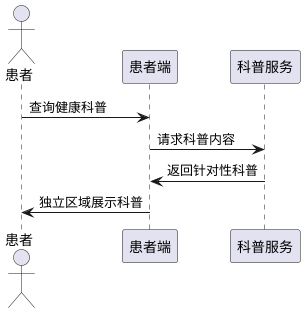

### **5.7.3 异常场景**
1. **科普内容为空**
   a. 触发条件：知识库中无匹配患者情况的科普内容。
   b. 系统行为：返回通用眩晕科普，不阻塞流程。
   c. 用户感知：看到通用科普内容。

## **5.8 患者端随访管理**

### **5.8.1 业务规则**
1. **随访记录规则**：诊后患者必须能通过平台记录症状变化、眩晕发作频率、用药情况。
   a. 验收条件：WHEN 患者提交随访反馈 THEN THE SYSTEM SHALL 保存反馈并关联到随访任务。
2. **提醒推送规则**：系统必须按随访计划推送用药提醒、复诊提醒、康复训练提醒、随访问卷。
   a. 验收条件：WHEN 随访计划到达提醒时间 THEN THE SYSTEM SHALL 向患者推送对应提醒。
3. **异常再就医提示规则**：随访中发现异常情况时，系统必须提示患者再次就医。
   a. 验收条件：WHEN 随访反馈触发异常规则 THEN THE SYSTEM SHALL 提示患者尽快就医并通知医生。
4. **随访问卷规则**：系统必须能向患者下发随访问卷并回收结果。
   a. 验收条件：WHEN 医生下发随访问卷 THEN THE SYSTEM SHALL 推送给患者并回收填写结果。

### **5.8.2 交互流程**
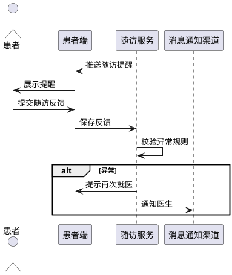

### **5.8.3 异常场景**
1. **随访反馈触发异常**
   a. 触发条件：患者反馈症状加重或出现新危险信号。
   b. 系统行为：提示患者就医，通知医生标记异常患者。
   c. 用户感知：看到再就医提示，医生收到异常通知。

## **5.9 医生端账户与登录**

### **5.9.1 业务规则**
1. **医生资质规则**：医生账号必须由管理员创建并维护资质信息，医生不能自助注册。
   a. 验收条件：WHEN 管理员创建医生账号 THEN THE SYSTEM SHALL 要求填写资质信息并保存。
2. **医生登录规则**：医生登录后才能访问患者工作台、问诊资料和处置功能。
   a. 验收条件：WHEN 未登录医生访问医生端 THEN THE SYSTEM SHALL 重定向到登录页。
3. **医生权限规则**：医生只能访问被授权或分配的患者，权限由后端校验。
   a. 验收条件：WHEN 医生请求未分配患者资料 THEN THE SYSTEM SHALL 返回未授权错误。

### **5.9.2 交互流程**
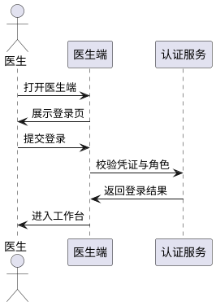

### **5.9.3 异常场景**
1. **医生资质未审核**
   a. 触发条件：医生账号资质未通过审核。
   b. 系统行为：拒绝登录到工作台，提示等待审核。
   c. 用户感知：提示"账号待审核，请等待管理员确认"。

## **5.10 医生患者工作台**

### **5.10.1 业务规则**
1. **患者列表展示规则**：医生工作台必须展示待接诊患者、已挂号患者、高风险患者、随访患者，并显示问诊状态和最近更新时间。
   a. 验收条件：WHEN 医生打开工作台 THEN THE SYSTEM SHALL 返回分类患者列表及状态与更新时间。
2. **风险等级突出规则**：医生端必须突出患者风险等级，红色仅用于危险、错误和紧急提示。
   a. 验收条件：WHEN 患者风险等级为紧急或高 THEN THE SYSTEM SHALL 以红色标记并在列表前置。
3. **患者分配规则**：医生只能看到分配给自己的患者，分配规则由管理员配置。
   a. 验收条件：WHEN 医生请求患者列表 THEN THE SYSTEM SHALL 仅返回分配给该医生的患者。

### **5.10.2 交互流程**
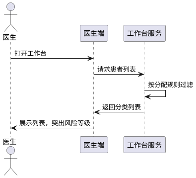

### **5.10.3 异常场景**
1. **无分配患者**
   a. 触发条件：医生未被分配任何患者。
   b. 系统行为：返回空列表，提示暂无患者。
   c. 用户感知：看到空状态提示。

## **5.11 AI 问诊资料查看**

### **5.11.1 业务规则**
1. **资料查看规则**：患者成功挂号后，对应医生必须能查看原始对话记录、AI 问诊摘要、关键症状时间线、危险信号标记、风险等级、推荐检查方向、患者补充病史资料。
   a. 验收条件：WHEN 医生打开已挂号患者资料页 THEN THE SYSTEM SHALL 返回上述七项内容。
2. **AI 建议与医生意见分离规则**：AI 建议和医生最终意见必须分别保存，医生端必须区分展示。
   a. 验收条件：WHEN 医生查看资料页 THEN THE SYSTEM SHALL 分别展示 AI 建议区域和医生意见区域。
3. **访问审计规则**：医生查看患者资料必须记录审计日志。
   a. 验收条件：WHEN 医生打开患者资料 THEN THE SYSTEM SHALL 记录访问行为到审计日志。

### **5.11.2 交互流程**
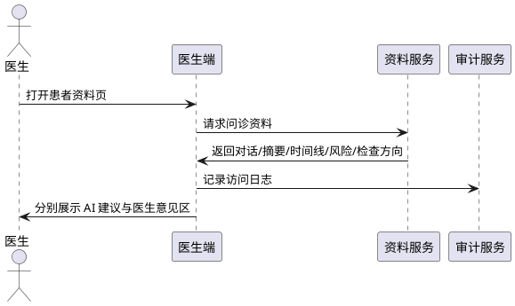

### **5.11.3 异常场景**
1. **患者未挂号**
   a. 触发条件：医生尝试查看未挂号患者资料。
   b. 系统行为：返回资料未移交提示。
   c. 用户感知：提示"该患者尚未挂号，问诊资料未移交"。

## **5.12 医生辅助分析**

### **5.12.1 业务规则**
1. **辅助分析内容规则**：系统必须为医生提供症状要点提取、需要进一步追问的问题、可能鉴别诊断方向、建议关注的危险信号、建议检查项目提示、对话内容结构化整理。
   a. 验收条件：WHEN 医生请求辅助分析 THEN THE SYSTEM SHALL 返回上述六项内容。
2. **辅助分析定位规则**：辅助分析只能作为参考，最终判断由医生完成，系统必须明确标注"仅供参考"。
   a. 验收条件：WHEN 辅助分析结果展示 THEN THE SYSTEM SHALL 显示"仅供参考，最终判断由医生完成"提示。
3. **辅助分析失败规则**：模型不可用时不得生成确定性诊断，保留已有危险提示。
   a. 验收条件：WHEN 辅助分析模型调用失败 THEN THE SYSTEM SHALL 返回失败提示并保留危险信号标记。

### **5.12.2 交互流程**
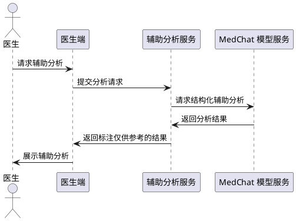

### **5.12.3 异常场景**
1. **辅助分析模型超时**
   a. 触发条件：辅助分析模型调用超过 30 秒。
   b. 系统行为：返回失败提示，保留危险信号标记，建议医生人工分析。
   c. 用户感知：提示"辅助分析暂时不可用，请人工分析"。

## **5.13 医生患者记录管理**

### **5.13.1 业务规则**
1. **历史记录查看规则**：医生必须能查看患者历史问诊记录、历史发作情况、既往诊疗记录、检查结果、随访数据、症状变化趋势。
   a. 验收条件：WHEN 医生打开患者记录页 THEN THE SYSTEM SHALL 返回上述六类数据。
2. **记录权限规则**：医生只能查看被分配患者的历史记录。
   a. 验收条件：WHEN 医生请求未分配患者记录 THEN THE SYSTEM SHALL 返回未授权错误。

### **5.13.2 交互流程**
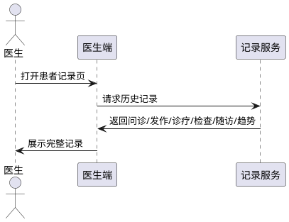

### **5.13.3 异常场景**
1. **患者无历史记录**
   a. 触发条件：患者为初诊无任何历史记录。
   b. 系统行为：返回空状态提示。
   c. 用户感知：看到"暂无历史记录"提示。

## **5.14 医生接诊与处置记录**

### **5.14.1 业务规则**
1. **处置记录填写规则**：医生必须能填写临床诊断、检查意见、治疗建议、用药方案、康复建议、复诊时间、随访计划。
   a. 验收条件：WHEN 医生提交处置记录 THEN THE SYSTEM SHALL 保存上述七项并关联患者。
2. **医生意见独立保存规则**：医生意见必须独立于 AI 建议保存，不能覆盖 AI 建议字段。
   a. 验收条件：WHEN 医生提交临床诊断 THEN THE SYSTEM SHALL 写入医生意见字段而非覆盖 AI 风险提示字段。
3. **处置记录审计规则**：医生提交处置记录必须记录审计日志。
   a. 验收条件：WHEN 医生提交处置 THEN THE SYSTEM SHALL 记录修改行为到审计日志。

### **5.14.2 交互流程**
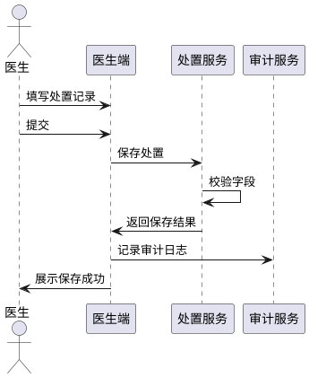

### **5.14.3 异常场景**
1. **处置记录字段缺失**
   a. 触发条件：医生未填写必填字段。
   b. 系统行为：返回字段校验错误。
   c. 用户感知：提示缺失字段名称。

## **5.15 医生随访任务管理**

### **5.15.1 业务规则**
1. **随访任务创建规则**：医生必须能创建随访任务、设置随访时间、下发随访问卷。
   a. 验收条件：WHEN 医生创建随访任务 THEN THE SYSTEM SHALL 保存任务并按时间推送提醒。
2. **随访反馈查看规则**：医生必须能查看患者随访反馈、标记异常患者、调整复诊计划、发送健康指导。
   a. 验收条件：WHEN 患者提交随访反馈 THEN THE SYSTEM SHALL 在医生端展示并支持标记异常。
3. **异常患者标记规则**：医生标记异常患者后，系统必须提示患者再次就医。
   a. 验收条件：WHEN 医生标记患者异常 THEN THE SYSTEM SHALL 向患者推送再就医提示。

### **5.15.2 交互流程**
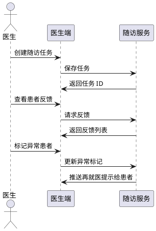

### **5.15.3 异常场景**
1. **随访任务时间冲突**
   a. 触发条件：同一患者同一时间已存在随访任务。
   b. 系统行为：返回冲突提示，建议调整时间。
   c. 用户感知：提示"该患者该时间已有随访任务"。

## **5.16 管理端用户与角色管理**

### **5.16.1 业务规则**
1. **账号管理规则**：管理员必须能管理患者账号、医生账号、管理员账号的创建、状态和权限。
   a. 验收条件：WHEN 管理员创建或修改账号 THEN THE SYSTEM SHALL 保存并记录审计日志。
2. **医生资质管理规则**：管理员必须能维护医生资质、科室信息、角色权限。
   a. 验收条件：WHEN 管理员更新医生资质 THEN THE SYSTEM SHALL 校验资质字段并保存。
3. **账号状态规则**：管理员必须能启用、禁用账号，禁用账号不能登录。
   a. 验收条件：WHEN 管理员禁用账号 THEN THE SYSTEM SHALL 立即生效该账号不能登录。

### **5.16.2 交互流程**
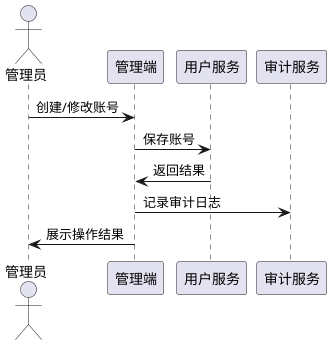

### **5.16.3 异常场景**
1. **重复账号**
   a. 触发条件：创建账号时手机号或邮箱已存在。
   b. 系统行为：返回重复错误。
   c. 用户感知：提示"该账号已存在"。

## **5.17 管理端医生与排班管理**

### **5.17.1 业务规则**
1. **排班管理规则**：管理员必须能维护医生信息、科室配置、出诊时间、号源配置、挂号状态、患者分配规则。
   a. 验收条件：WHEN 管理员配置排班 THEN THE SYSTEM SHALL 保存并生效到挂号推荐。
2. **号源配置规则**：号源必须可配置数量和时段，挂号时按号源余量校验。
   a. 验收条件：WHEN 患者挂号时号源余量为 0 THEN THE SYSTEM SHALL 拒绝挂号。

### **5.17.2 交互流程**
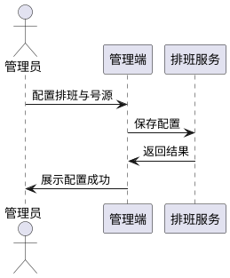

### **5.17.3 异常场景**
1. **排班时间冲突**
   a. 触发条件：同一医生同一时段重复排班。
   b. 系统行为：返回冲突错误。
   c. 用户感知：提示"该医生该时段已排班"。

## **5.18 管理端模型管理**

### **5.18.1 业务规则**
1. **模型版本管理规则**：管理员必须能管理 MedChat 及后续模型版本、服务地址、API 配置、提示词版本、上线与下线。
   a. 验收条件：WHEN 管理员切换模型版本 THEN THE SYSTEM SHALL 新会话使用新版本，已上线会话不中断。
2. **模型调用监控规则**：管理员必须能查看调用状态、推理日志、失败重试、模型效果评估。
   a. 验收条件：WHEN 管理员查看模型监控 THEN THE SYSTEM SHALL 返回调用成功率、失败次数、推理日志摘要。
3. **日志脱敏规则**：推理日志不得记录完整敏感对话。
   a. 验收条件：WHEN 模型调用日志写入 THEN THE SYSTEM SHALL 脱敏处理不记录完整对话。

### **5.18.2 交互流程**
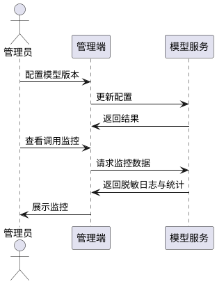

### **5.18.3 异常场景**
1. **模型版本切换失败**
   a. 触发条件：新版本服务地址不可达。
   b. 系统行为：拒绝切换，保留原版本。
   c. 用户感知：提示"新版本不可用，已保留原版本"。

## **5.19 管理端知识库管理**

### **5.19.1 业务规则**
1. **知识库维护规则**：管理员必须能维护医疗科普内容、常见疾病知识、危险信号规则、问诊问题模板、医院与科室信息、挂号推荐规则。
   a. 验收条件：WHEN 管理员更新危险信号规则 THEN THE SYSTEM SHALL 立即生效到规则引擎。
2. **规则生效规则**：危险信号规则变更必须即时生效，不影响进行中的问诊会话上下文。
   a. 验收条件：WHEN 规则更新后新问诊发起 THEN THE SYSTEM SHALL 使用最新规则。

### **5.19.2 交互流程**
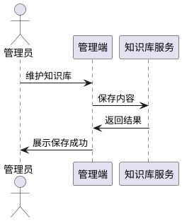

### **5.19.3 异常场景**
1. **规则配置错误**
   a. 触发条件：危险信号规则配置语法错误。
   b. 系统行为：返回校验错误，不生效。
   c. 用户感知：提示规则配置错误详情。

## **5.20 管理端数据与运营统计**

### **5.20.1 业务规则**
1. **统计指标规则**：管理员必须能统计问诊人数、挂号转化率、高风险患者数量、平均问诊时长、医生接诊量、随访完成率、模型调用成功率、用户反馈。
   a. 验收条件：WHEN 管理员请求统计报表 THEN THE SYSTEM SHALL 返回上述八项指标。
2. **统计权限规则**：仅管理员能查看运营统计，医生和患者无权限。
   a. 验收条件：WHEN 非管理员请求统计 THEN THE SYSTEM SHALL 返回未授权错误。

### **5.20.2 交互流程**
```plantuml
@startuml
actor 管理员
participant "管理端" as App
participant "统计服务" as Stat
管理员 -> App : 请求统计报表
App -> Stat : 查询指标
Stat -> App : 返回报表数据
App -> 管理员 : 展示报表
@enduml
```

### **5.20.3 异常场景**
1. **统计查询超时**
   a. 触发条件：统计查询超过 5 秒。
   b. 系统行为：返回超时错误，建议缩小时间范围。
   c. 用户感知：提示"查询超时，请缩小时间范围重试"。

## **5.21 管理端审计与安全管理**

### **5.21.1 业务规则**
1. **审计日志记录规则**：系统必须记录用户登录、患者资料访问、医生查看行为、数据修改记录、管理员操作、模型调用、权限异常、安全告警。
   a. 验收条件：WHEN 任一上述行为发生 THEN THE SYSTEM SHALL 写入审计日志。
2. **审计日志查询规则**：管理员必须能查询审计日志，审计日志不可篡改。
   a. 验收条件：WHEN 管理员查询审计日志 THEN THE SYSTEM SHALL 返回按时间倒序的日志列表。
3. **安全告警规则**：权限异常和敏感数据异常访问必须触发安全告警。
   a. 验收条件：WHEN 检测到权限异常 THEN THE SYSTEM SHALL 记录安全告警并通知管理员。

### **5.21.2 交互流程**
```plantuml
@startuml
actor 管理员
participant "管理端" as App
participant "审计服务" as Audit
管理员 -> App : 查询审计日志
App -> Audit : 请求日志
Audit -> App : 返回日志列表
App -> 管理员 : 展示审计日志
@enduml
```

### **5.21.3 异常场景**
1. **审计日志查询越权**
   a. 触发条件：非管理员查询审计日志。
   b. 系统行为：返回未授权错误并记录安全告警。
   c. 用户感知：提示"无权访问审计日志"。

# **6. 数据约束**

## **6.1 患者账号**
1. **患者 ID**：系统唯一标识，必填，全局唯一。
2. **手机号**：必填，格式合法，唯一。
3. **邮箱**：选填，格式合法，唯一。
4. **密码哈希**：必填，使用成熟算法哈希存储，禁止明文。
5. **账号状态**：必填，取值为正常或禁用，默认正常。
6. **创建时间**：必填，UTC 时间。
7. **最近登录时间**：选填，UTC 时间。

## **6.2 医生账号**
1. **医生 ID**：系统唯一标识，必填，全局唯一。
2. **姓名**：必填。
3. **手机号**：必填，唯一。
4. **资质信息**：必填，包含执业证书、科室、职称。
5. **账号状态**：必填，取值为待审核、正常或禁用。
6. **所属科室**：必填，关联科室信息。

## **6.3 问诊会话**
1. **会话 ID**：系统唯一标识，必填。
2. **患者 ID**：必填，关联患者账号。
3. **状态**：必填，取值为进行中、已结束、已生成报告、已移交医生。
4. **创建时间**：必填，UTC 时间。
5. **结束时间**：选填，UTC 时间。
6. **风险等级**：选填，取值为紧急、高、中、低，由规则引擎与模型结果取更高者确定。
7. **危险信号标记**：必填，标识是否触发危险信号，默认否。

## **6.4 问诊消息**
1. **消息 ID**：系统唯一标识，必填。
2. **会话 ID**：必填，关联问诊会话。
3. **角色**：必填，取值为患者、模型、系统。
4. **内容**：必填，消息文本。
5. **发送时间**：必填，UTC 时间。
6. **模型版本**：选填，当角色为模型时记录所用模型版本。

## **6.5 风险评估结果**
1. **评估 ID**：系统唯一标识，必填。
2. **会话 ID**：必填，关联问诊会话。
3. **规则引擎风险等级**：必填，取值为紧急、高、中、低。
4. **模型风险等级**：选填，取值为紧急、高、中、低。
5. **最终风险等级**：必填，取规则引擎与模型中更高者。
6. **推荐就诊科室**：必填。
7. **建议就诊时效**：必填，取值为立即急诊、24 小时内、一周内、按需。
8. **是否建议立即就医**：必填，布尔值。
9. **可能疾病方向**：选填，列表形式，表述必须使用"可能"等非确定性词汇。

## **6.6 问诊报告**
1. **报告 ID**：系统唯一标识，必填。
2. **会话 ID**：必填，关联问诊会话，唯一。
3. **主诉**：必填。
4. **发作特点**：必填。
5. **诱发因素**：选填。
6. **伴随症状**：选填。
7. **危险信号**：必填，列表形式。
8. **既往史**：选填。
9. **用药情况**：选填。
10. **AI 初步风险提示**：必填，独立于医生意见保存。
11. **推荐就诊方向**：必填。

## **6.7 挂号订单**
1. **订单 ID**：系统唯一标识，必填。
2. **会话 ID**：必填，关联问诊会话。
3. **患者 ID**：必填，关联患者账号。
4. **医生 ID**：必填，关联医生账号。
5. **科室**：必填。
6. **预约时间**：必填，UTC 时间。
7. **医院或院区**：必填。
8. **订单状态**：必填，取值为已创建、已确认、已取消、已完成。
9. **创建时间**：必填，UTC 时间。
10. **唯一约束**：同一会话 ID、医生 ID、预约时间组合唯一。

## **6.8 医生处置记录**
1. **处置 ID**：系统唯一标识，必填。
2. **患者 ID**：必填，关联患者账号。
3. **医生 ID**：必填，关联医生账号。
4. **临床诊断**：必填，独立于 AI 风险提示保存。
5. **检查意见**：选填。
6. **治疗建议**：选填。
7. **用药方案**：选填。
8. **康复建议**：选填。
9. **复诊时间**：选填，UTC 时间。
10. **随访计划**：选填。
11. **提交时间**：必填，UTC 时间。

## **6.9 随访任务**
1. **任务 ID**：系统唯一标识，必填。
2. **患者 ID**：必填，关联患者账号。
3. **医生 ID**：必填，关联医生账号。
4. **随访时间**：必填，UTC 时间。
5. **任务类型**：必填，取值为用药提醒、复诊提醒、康复训练提醒、随访问卷、异常再就医提示。
6. **任务状态**：必填，取值为待执行、已完成、已取消。
7. **异常标记**：必填，布尔值，默认否。

## **6.10 审计日志**
1. **日志 ID**：系统唯一标识，必填。
2. **操作人 ID**：必填。
3. **操作类型**：必填，取值为登录、资料访问、数据修改、管理员操作、模型调用、权限异常、安全告警。
4. **操作时间**：必填，UTC 时间。
5. **操作详情**：必填，脱敏后的摘要，禁止记录完整敏感对话、密码和 Token。
6. **不可篡改**：审计日志写入后禁止修改和删除。

## **6.11 模型配置**
1. **配置 ID**：系统唯一标识，必填。
2. **模型版本**：必填，唯一。
3. **服务地址**：必填，合法 URL。
4. **API 配置**：必填，密钥存于环境变量，禁止明文存储。
5. **提示词版本**：必填。
6. **状态**：必填，取值为上线、下线。
7. **当前生效版本**：全局唯一，同一时间仅一个版本为生效版本。